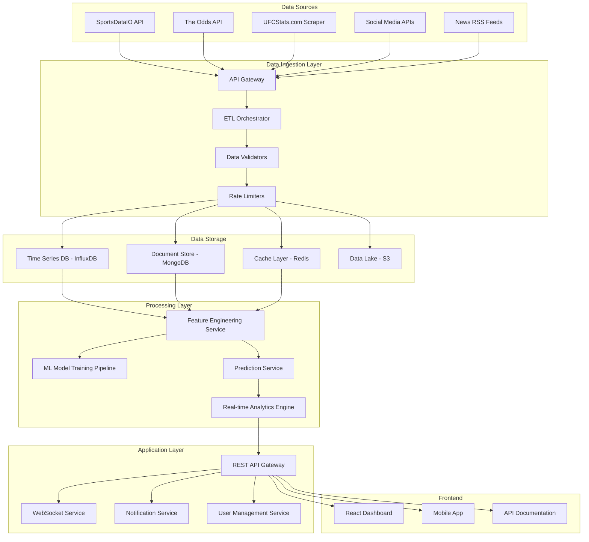

# UFC Prediction Platform Design Document

## Overview

The UFC Prediction Platform is a microservices-based system that aggregates data from multiple sources, processes it through machine learning pipelines, and provides real-time insights through web APIs and user interfaces. The architecture emphasizes data quality, real-time processing, and scalable ML model deployment while maintaining clear separation between analytical insights and gambling activities.

## Architecture

### High-Level Architecture



### Technology Stack

- **Backend**: Node.js with TypeScript for API services, Python for ML pipelines
- **Databases**: 
  - InfluxDB for time-series data (odds movements, performance metrics)
  - MongoDB for document storage (fighter profiles, fight records)
  - Redis for caching and real-time data
  - S3 for data lake and model artifacts
- **ML/AI**: Python with scikit-learn, XGBoost, TensorFlow for model development
- **Message Queue**: Apache Kafka for event streaming
- **Monitoring**: Prometheus + Grafana for system metrics
- **Frontend**: React with TypeScript, Chart.js for visualizations
- **Infrastructure**: Docker containers, Kubernetes for orchestration

## Components and Interfaces

### Data Ingestion Service

**Purpose**: Orchestrate data collection from multiple external sources with proper error handling and rate limiting.

**Key Components**:
- `APIConnector`: Generic interface for external API integration
- `ScrapingEngine`: Web scraping with rotating proxies and anti-detection
- `DataValidator`: Schema validation and data quality checks
- `RateLimiter`: Intelligent rate limiting per source with backoff strategies

**Interfaces**:
```typescript
interface DataSource {
  id: string;
  type: 'api' | 'scraper' | 'feed';
  config: SourceConfig;
  lastSync: Date;
  status: 'active' | 'error' | 'rate_limited';
}

interface DataIngestionResult {
  sourceId: string;
  recordsProcessed: number;
  errors: ValidationError[];
  nextSyncTime: Date;
}
```

### Fighter Analytics Service

**Purpose**: Maintain comprehensive fighter profiles with calculated metrics and trend analysis.

**Key Components**:
- `FighterProfileManager`: CRUD operations for fighter data
- `MetricsCalculator`: Rolling averages, trend analysis, performance indicators
- `ComparisonEngine`: Side-by-side fighter comparisons with statistical significance

**Interfaces**:
```typescript
interface FighterProfile {
  id: string;
  personalInfo: PersonalInfo;
  physicalStats: PhysicalStats;
  fightHistory: FightRecord[];
  calculatedMetrics: PerformanceMetrics;
  trends: TrendAnalysis;
  lastUpdated: Date;
}

interface PerformanceMetrics {
  strikingAccuracy: RollingAverage;
  takedownDefense: RollingAverage;
  fightFrequency: number;
  winStreak: number;
  recentForm: FormIndicator[];
}
```

### Odds Tracking Service

**Purpose**: Monitor betting lines across multiple sportsbooks with real-time movement detection.

**Key Components**:
- `OddsAggregator`: Collect odds from multiple sources
- `MovementDetector`: Identify significant line movements
- `ArbitrageScanner`: Detect potential arbitrage opportunities
- `HistoricalAnalyzer`: Calculate closing line value and market efficiency

**Interfaces**:
```typescript
interface OddsSnapshot {
  fightId: string;
  sportsbook: string;
  timestamp: Date;
  moneyline: { fighter1: number; fighter2: number };
  method: MethodOdds;
  rounds: RoundOdds;
}

interface MovementAlert {
  fightId: string;
  movementType: 'significant' | 'reverse' | 'steam';
  oldOdds: OddsSnapshot;
  newOdds: OddsSnapshot;
  percentageChange: number;
}
```

### Machine Learning Service

**Purpose**: Train, deploy, and serve ML models for fight outcome predictions.

**Key Components**:
- `ModelTrainer`: Automated model training with hyperparameter optimization
- `FeatureEngineer`: Transform raw data into ML-ready features
- `PredictionEngine`: Serve real-time predictions with confidence intervals
- `ModelEvaluator`: Continuous model performance monitoring and backtesting

**Interfaces**:
```typescript
interface PredictionRequest {
  fightId: string;
  fighter1Id: string;
  fighter2Id: string;
  contextualData: ContextualFeatures;
}

interface PredictionResult {
  winnerProbability: { fighter1: number; fighter2: number };
  methodPrediction: MethodProbabilities;
  roundPrediction: RoundProbabilities;
  confidence: number;
  keyFactors: FeatureImportance[];
  modelVersion: string;
}
```

### Notification Service

**Purpose**: Deliver personalized alerts and updates to users based on their preferences.

**Key Components**:
- `AlertManager`: Configure and manage user alert preferences
- `NotificationDispatcher`: Multi-channel notification delivery (email, push, SMS)
- `EventProcessor`: Process system events and trigger appropriate notifications

**Interfaces**:
```typescript
interface UserPreferences {
  userId: string;
  followedFighters: string[];
  weightClasses: WeightClass[];
  alertTypes: AlertType[];
  deliveryMethods: DeliveryMethod[];
  thresholds: AlertThresholds;
}

interface NotificationEvent {
  type: 'odds_movement' | 'fight_update' | 'prediction_change' | 'injury_report';
  fightId?: string;
  fighterId?: string;
  data: any;
  priority: 'low' | 'medium' | 'high' | 'urgent';
}
```

## Data Models

### Core Entities

**Fighter Entity**:
```typescript
interface Fighter {
  id: string;
  name: string;
  nickname?: string;
  physicalStats: {
    height: number; // inches
    weight: number; // lbs
    reach: number; // inches
    legReach: number; // inches
    stance: 'Orthodox' | 'Southpaw' | 'Switch';
  };
  record: {
    wins: number;
    losses: number;
    draws: number;
    noContests: number;
  };
  rankings: {
    weightClass: WeightClass;
    rank?: number;
    p4pRank?: number;
  };
  camp: {
    name: string;
    location: string;
    headCoach: string;
  };
  socialMedia: {
    instagram?: string;
    twitter?: string;
  };
}
```

**Fight Entity**:
```typescript
interface Fight {
  id: string;
  eventId: string;
  fighter1Id: string;
  fighter2Id: string;
  weightClass: WeightClass;
  titleFight: boolean;
  mainEvent: boolean;
  scheduledRounds: number;
  status: 'scheduled' | 'in_progress' | 'completed' | 'cancelled';
  result?: FightResult;
  odds: OddsHistory[];
  predictions: PredictionHistory[];
}
```

**Event Entity**:
```typescript
interface Event {
  id: string;
  name: string;
  date: Date;
  venue: {
    name: string;
    city: string;
    state?: string;
    country: string;
    altitude?: number;
  };
  commission: string;
  fights: string[]; // Fight IDs
}
```

### Time-Series Data Models

**Odds Time Series**:
```typescript
interface OddsTimeSeries {
  timestamp: Date;
  fightId: string;
  sportsbook: string;
  odds: {
    moneyline: [number, number];
    method: MethodOdds;
    rounds: RoundOdds;
  };
  volume?: number;
  impliedProbability: [number, number];
}
```

**Performance Metrics Time Series**:
```typescript
interface PerformanceTimeSeries {
  timestamp: Date;
  fighterId: string;
  metrics: {
    strikesLandedPerMinute: number;
    strikingAccuracy: number;
    takedownAccuracy: number;
    takedownDefense: number;
    submissionAttempts: number;
    controlTime: number;
  };
  fightId: string;
  opponent: string;
}
```

## Error Handling

### Data Source Failures

**Strategy**: Implement circuit breaker pattern with graceful degradation
- **Primary Source Failure**: Automatically switch to backup data sources
- **Rate Limiting**: Implement exponential backoff with jitter
- **Data Quality Issues**: Flag suspicious data and use confidence scoring
- **Network Issues**: Queue requests for retry with persistent storage

### Model Prediction Errors

**Strategy**: Ensemble approach with fallback mechanisms
- **Model Unavailable**: Use cached predictions with staleness indicators
- **Low Confidence**: Clearly communicate uncertainty to users
- **Feature Missing**: Use imputation strategies or exclude from prediction
- **Version Conflicts**: Maintain backward compatibility for model versions

### Real-time Processing Failures

**Strategy**: Event sourcing with replay capabilities
- **Stream Processing Lag**: Implement backpressure handling
- **Notification Failures**: Retry with exponential backoff, dead letter queues
- **Cache Invalidation**: Use cache-aside pattern with TTL management
- **Database Connectivity**: Connection pooling with health checks

## Testing Strategy

### Unit Testing
- **Coverage Target**: 90% code coverage for business logic
- **Mock Strategy**: Mock external APIs and databases
- **Test Data**: Use factory pattern for generating test fixtures
- **Assertion Libraries**: Jest for JavaScript/TypeScript, pytest for Python

### Integration Testing
- **API Testing**: Test all REST endpoints with various scenarios
- **Database Testing**: Use test containers for database integration tests
- **Message Queue Testing**: Test event publishing and consumption
- **External API Testing**: Use contract testing with Pact

### End-to-End Testing
- **User Journeys**: Test complete workflows from data ingestion to prediction
- **Performance Testing**: Load testing for high-traffic scenarios
- **Chaos Engineering**: Test system resilience with failure injection
- **Browser Testing**: Automated UI testing with Playwright

### ML Model Testing
- **Model Validation**: Cross-validation with time-based splits
- **Backtesting**: Historical performance evaluation with walk-forward analysis
- **A/B Testing**: Compare model versions in production
- **Data Drift Detection**: Monitor feature distributions over time
- **Bias Testing**: Evaluate model fairness across different fighter demographics

### Monitoring and Observability
- **Application Metrics**: Response times, error rates, throughput
- **Business Metrics**: Prediction accuracy, user engagement, data freshness
- **Infrastructure Metrics**: CPU, memory, disk usage, network latency
- **Custom Dashboards**: Real-time monitoring of critical system components
- **Alerting**: Automated alerts for system anomalies and business rule violations